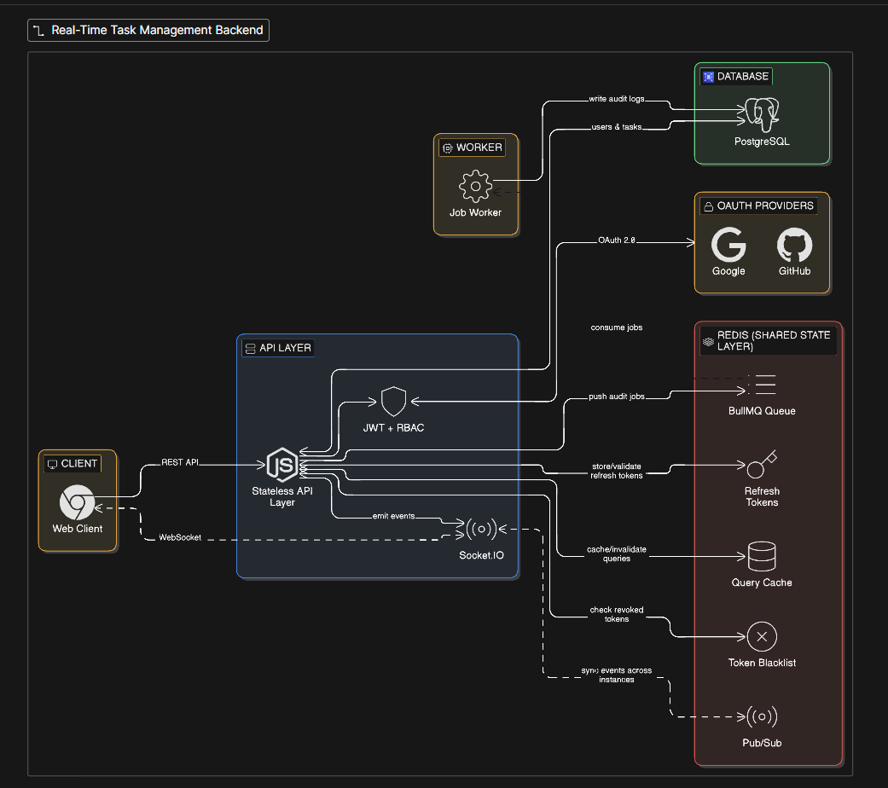

# 🚀 Real-Time Task Management Backend

A production-style backend system designed to go beyond CRUD and demonstrate real-world backend architecture, scalability patterns, and distributed system concepts.

---

## 🧠 Overview

This project focuses on **how systems behave**, not just what they do.

It implements a real-time task management backend with:

- Secure authentication
- Role-based authorization
- Real-time updates
- Asynchronous job processing
- Redis-powered scalability
- Production-grade architecture patterns

---

## 🏗 System Architecture



> High-level architecture showing API layer, Redis (multi-role), worker system, and realtime communication.

---

## ⚙️ Tech Stack

### Backend
- Node.js
- Express.js
- PostgreSQL
- Prisma ORM

### Authentication & Security
- OAuth 2.0 (Google + GitHub)
- JWT (Access + Refresh Tokens)
- Redis-based session storage
- Token blacklist (revocation)

### Realtime
- Socket.IO
- Authenticated WebSocket connections
- User rooms & admin channels
- Redis Pub/Sub adapter

### Distributed Systems
- Redis (multi-purpose usage)
- BullMQ (background jobs)
- Worker architecture

---

## 🔐 Authentication Flow

- OAuth login via Google/GitHub
- Access Token (short-lived, stateless)
- Refresh Token (stored in Redis)
- Logout invalidates session + blacklists access token

---

## 🛡 Authorization

- Role-Based Access Control (RBAC)
- Resource-level ownership checks
- Admin override capabilities

---

## ⚡ Features

### Task Management
- Create, update, delete tasks
- Assign tasks to users
- Ownership + admin controls

### Real-Time Updates
- Task creation, updates, deletion events
- User-scoped socket rooms
- Admin broadcast channel

### Audit Logging (Async)
- All actions logged via BullMQ
- Worker processes jobs independently
- Retry + failure handling

---

## 🔴 Redis Usage (Core Highlight)

Redis is used as a **central system layer**:

- 🔑 Refresh token storage
- 🚫 Access token blacklist
- ⚡ Socket.IO Pub/Sub (multi-instance scaling)
- 📦 BullMQ job queue
- ⚡ Task caching layer

---

## 🧱 Architecture Highlights

- Stateless API design
- Shared state via Redis
- Separation of sync vs async processing
- Event-driven realtime system
- Horizontally scalable design

---

## 🗄 Database Design

- PostgreSQL with Prisma ORM
- Proper relational modeling
- Indexed queries for performance:
  - `(assigneeId, createdAt)`
  - Audit log filters (userId, action, etc.)

---

## 📡 API Endpoints (Sample)

```http
POST /auth/google
POST /auth/github
POST /auth/refresh
POST /auth/logout

GET /tasks
POST /tasks
PATCH /tasks/:id
DELETE /tasks/:id
PATCH /tasks/:id/assign
```

---

## 🔄 Async Processing (BullMQ)

`API → Redis Queue → Worker → Database`


- Non-blocking request handling
- Retry + backoff strategy
- Scalable worker architecture

---

## ⚡ Realtime Flow

`API emits event → Redis Pub/Sub → All servers → Clients receive update`


---

## 🚀 Getting Started

### 1. Clone the repo

```bash
git clone https://github.com/your-username/your-repo.git
cd your-repo
```

### 2. Install dependencies
```bash
npm install
```

### 3. Create .env

```env
DATABASE_URL=your_postgres_url
REDIS_URL=redis://localhost:6379

JWT_ACCESS_SECRET=your_secret
JWT_REFRESH_SECRET=your_secret

GOOGLE_CLIENT_ID=...
GOOGLE_CLIENT_SECRET=...

GITHUB_CLIENT_ID=...
GITHUB_CLIENT_SECRET=...
```

### 4. Run database migrations

```bash
npx prisma migrate dev
```

### 5. Start services

#### API Server
```bash
npm run dev
```

#### Worker
```bash
npm run worker
```


